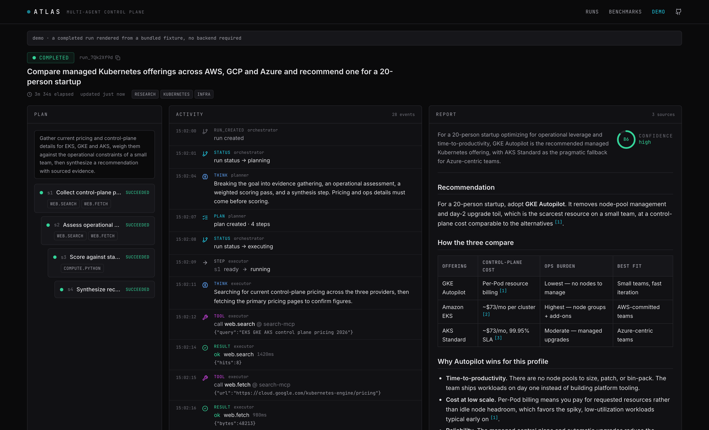
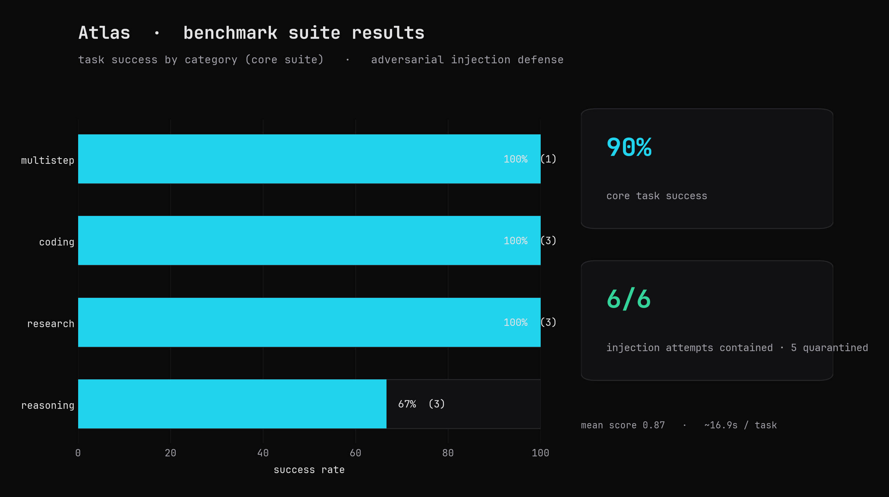

<div align="center">

# Atlas

**A self-hosted, MCP-native multi-agent platform with a planner–executor–critic architecture.**

Give it a goal. It plans the work, executes it with standards-based tools, verifies its own output, and returns a citation-backed report — with human approval gates, live-streamed reasoning, and durable execution that survives a crash.

[](https://github.com/AymanYouss/atlas-agents/actions/workflows/ci.yml)
[](LICENSE)
[](pyproject.toml)
[](frontend/package.json)

### 90% task success on the core benchmark · 6/6 prompt-injection attempts contained

</div>

---

Most "agent" repos are a notebook and a prompt. Atlas is the opposite: a real system with a typed orchestration graph, a standards-based (Model Context Protocol) tool layer, a hardened code sandbox, a guardrail stack, durable checkpointing, a shipped-quality web console, and — the part that actually matters — **an evaluation harness that scores whether any of it works.**

<p align="center">
  
</p>

## Why Atlas

| | |
|---|---|
| **Planner → Executor → Critic** | A planner decomposes the goal into a dependency-aware plan; executor agents run tools in a ReAct loop; a critic independently verifies each step and the final report, triggering targeted retries or a replan. |
| **MCP-native tools** | Web search, sandboxed code execution, and file I/O ship built-in — and any [Model Context Protocol](https://modelcontextprotocol.io) server plugs in at runtime, discovered and proxied like a native tool. Atlas also exposes *its own* tools as an MCP server. |
| **Durable execution** | State is checkpointed after every node (Postgres via LangGraph). A crashed run resumes from the last committed step instead of starting over. |
| **Human-in-the-loop** | Sensitive steps pause at an approval gate; the run suspends durably and resumes on an approve / reject / edit decision. |
| **Guardrails** | Every untrusted tool result is scanned for prompt injection and fenced as data; hard budgets bound steps, tokens, wall-clock time, and runaway loops. |
| **Evaluated, not vibes** | A benchmark suite scores end-to-end task success; an adversarial suite measures injection resistance. Numbers, not adjectives. |

## The value screen

The run visualizer streams the plan tree, live agent reasoning, tool calls, approvals, and the final cited report as the run happens.

<p align="center">
  
</p>

## Benchmarks

Run it yourself: `atlas eval run --all --out results.json`. Latest results (`docs/benchmarks/results.json`):

<p align="center">
  
</p>

| Suite | Metric | Result |
|-------|--------|--------|
| core (10 tasks) | task success rate | **90%** |
| core | mean rubric score | 0.87 |
| injection (6 tasks) | attacks contained | **6 / 6** |
| injection | poisoned payloads quarantined | 5 |

## Quickstart

### Docker Compose (full stack)

```bash
git clone https://github.com/AymanYouss/atlas-agents && cd atlas-agents
make sandbox-image                      # build the hardened code-execution image
export ANTHROPIC_API_KEY=sk-ant-...     # your keys
export TAVILY_API_KEY=tvly-...
docker compose -f deploy/docker/docker-compose.yml up --build
```

- Web console → http://localhost:8080
- API + OpenAPI docs → http://localhost:8000/docs

### Local development

```bash
make install                            # uv venv + deps
cp .env.example .env                    # add your keys
make run                                # API at :8000
cd frontend && pnpm install && pnpm dev # UI at :5173
```

### One-shot from the CLI

```bash
atlas run "Compare managed Kubernetes across AWS, GCP and Azure and recommend one for a 20-person startup"
```

## How it works

```
      goal
        │
   ┌────▼─────┐        ┌───────────────── retry (critic-guided) ─────────────────┐
   │ Planner  │        │                                                          │
   └────┬─────┘   ┌────▼─────┐   allow-listed    ┌───────────────┐        ┌───────┴──────┐
        └────────▶│ Executor │──── tool calls ──▶│ Tool Registry │──────▶ │ built-ins +  │
                  └────┬─────┘   (scanned+fenced)└───────────────┘        │ MCP + sandbox│
              approval │                                                  └──────────────┘
               gate ◀──┤                                                          
                  ┌────▼─────┐   pass    ┌──────────────┐
                  │  Critic  │──────────▶│ Synthesizer  │──▶ cited report
                  └────┬─────┘           └──────────────┘
                       └── replan ─▶ Planner
```

Every node's state is checkpointed to Postgres, so the whole thing is resumable. Full detail in [`docs/architecture.md`](docs/architecture.md).

## Project layout

```
atlas/
  agents/        planner · executor (ReAct) · critic · report synthesizer
  graph/         LangGraph state machine, orchestrator, durable checkpointing
  tools/         tool registry (allow-list) + built-in tools
  mcp/           MCP client (attach any server) + MCP server (expose Atlas tools)
  sandbox/       hardened Docker code execution
  guardrails/    prompt-injection scanner + runtime budgets
  llm/           provider-agnostic client (Anthropic default, OpenAI drop-in)
  persistence/   Postgres + in-memory repositories, Alembic migrations
  api/ · main    FastAPI: runs, SSE stream, approvals, /metrics
  eval/          benchmark suites, scorers, runner
frontend/        React + TypeScript control-plane UI
deploy/          Dockerfiles, docker-compose, Kubernetes, AWS Terraform
```

## Tech stack

**Backend** Python 3.12 · LangGraph · FastAPI · Pydantic v2 · SQLAlchemy 2 (async) · Postgres · MCP · Docker
**Frontend** React 18 · TypeScript · Vite · Tailwind · TanStack Query · Server-Sent Events
**LLM** Anthropic Claude (Opus for planning/critique, Sonnet for execution) behind a provider abstraction
**Infra** Docker · Kubernetes (Kustomize) · AWS (EKS · RDS · ECR · Secrets Manager) via Terraform · GitHub Actions

## Deployment

Local Compose, Kubernetes manifests (Pod Security Standards, HPA, PDB, NetworkPolicies), and full AWS Terraform (EKS + Multi-AZ RDS + ECR + IRSA) are documented in [`deploy/README.md`](deploy/README.md).

## License

[MIT](LICENSE) © Ayman Youss
